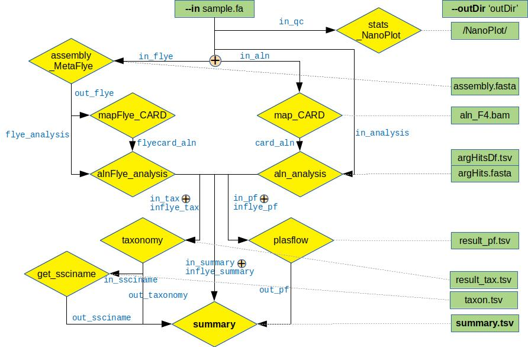

# longmetarg
Nextflow pipeline for the identifiation of antibiotic resistance genes in metagenomic long reads

## Introduction

``longMetARG`` is a bioinformatics pipeline that can be used to find antibiotic resistance genes in metagenomic long reads. 

The pipeline takes in (*--input*) a fasta file with long read sequences. It then is passed to generate statistics by ``NanoPlot`` and is either processed directly by mapping the reads to the curated antibiotic resistance-gene database (*CARD*) with ```minimap2``` or is passed to an assembly process using ```metaFlye``` prior to mapping. Aligned reads/contigs are filtered by identity and coverage length only keeping the best non-overlapping hits. The resulting files are passed to a process using ```PlasFlow``` to determine the probable location of the gene (plasmid or chromosome), to the taxonomy process where the filtered sequences are analysed by either ```Blast``` or ```Diamond``` and to annotate the most probable taxonomic names. All output files are stored in the output directory (*--outdir*). The summary process joins the main output features in the ```summary.tsv``` file.

The pipeline is built using ```Nextflow```, a workflow tool to run tasks across multiple compute infrastructures in a very portable manner.

## Pipeline summary



## Get Started

1. Install ```Nextflow``` (>=21.04.0).
2. Install ```Conda``` or ```Miniconda``` (Docker will be enabled soon).
3. Install the CARD database following the instructions on [https://card.mcmaster.ca/](https://card.mcmaster.ca/download). Either instal the *card_database_v\*.fasta* in the directory containing ```longMetARG main.nf``` in a folder named ```card_db``` of indicate the location of the folder and databases file name using the command ```--argDb```.
4. Store the file ```aro_index.tsv``` from the [CARD ontology](https://card.mcmaster.ca/](https://card.mcmaster.ca/download) in the ```/bin``` folder of the working directory or indicate its location with the command ```--drugClass```.
5. Install the reference database for Blast (default: *ref_prok_rep_genomes*) or Diamond (default: *nr.dmnd*) in the working directory naming the folders ```blast_db``` or ```diamond_db```, respectively. If the reference database already exists in your system, indicate location and name using ```--blastDbDir   --blastDbName``` or ```--diamondDbDir   --diamondDbName```.
6. Download the pipeline and test it on a minimal dataset (*test.fasta*) running the command inside the folder containing the installed files:
 ```./nextflow run main.nf --input test.fasta -profile conda```
